## Server Manager API

A lightweight Laravel API for managing cloud servers with CRUD operations, authentication, bulk actions, validation, and performance optimizations.

## Author
Mahady Hasan Milon

## Track Chosen

Track A — Backend API

Reason: Focused on building a robust, secure, and testable REST API with authentication, validation, pagination, filtering, bulk actions, and performance improvements.
---

## Table of Contents
- [Project Setup](#project-setup)
- [Environment Variables](#environment-variables)
- [Database Setup](#database-setup)
- [Run the Project](#run-the-project)
- [API Endpoints](#api-endpoints)
- [Validation Rules](#validation-rules)
- [Running Tests](#running-tests)
- [Postman Collection](#postman-collection)

---

## Project Setup

Clone the repository:

```bash
git clone <your-repo-url>
cd server-manager
```

## Install dependencies:
```bash
composer install
```

## Build Docker containers:
```bash
./vendor/bin/sail up -d
```

## Environment Variables
Copy .env.example to .env and update values:
```bash
APP_NAME=Laravel
APP_ENV=local
APP_KEY=base64:...
APP_DEBUG=true
APP_URL=http://localhost

DB_CONNECTION=pgsql
DB_HOST=pgsql
DB_PORT=5432
DB_DATABASE=server_manager
DB_USERNAME=server_manager
DB_PASSWORD=server_manager
```

## For testing, add a testing database:
```bash
docker exec -it server-manager-pgsql-1 psql -U server_manager -c "CREATE DATABASE testing;"
```

## Database Setup
Run migrations and seeders:
```bash
./vendor/bin/sail artisan migrate --seed
```

## Run the Project
Start Laravel:
```bash
./vendor/bin/sail artisan serve
```

# The API is available at:
http://localhost/api

## API Endpoints
Headers (all requests):
```bash
Accept: application/json
Content-Type: application/json
```

## Authentication
| Method | Endpoint      | Description                 | Request Body                                  | Response Example            |
| ------ | ------------- | --------------------------- | --------------------------------------------- | --------------------------- |
| POST   | /api/register | Register new user           | name, email, password, password\_confirmation | `{ token: "..." }`          |
| POST   | /api/login    | Login user                  | email, password                               | `{ token: "..." }`          |
| POST   | /api/logout   | Logout user (auth required) | –                                             | `{ message: "Logged out" }` |

| Method | Endpoint               | Description          | Request Body                                                                 | Response Example                                             |
| ------ | ---------------------- | -------------------- | ---------------------------------------------------------------------------- | ------------------------------------------------------------ |
| GET    | /api/servers           | List all servers     | –                                                                            | `{ data: [...], status: "success", message: "Success" }`     |
| POST   | /api/servers           | Create server        | name, ip\_address, provider, cpu\_cores, ram\_mb, storage\_gb, status        | `{ data: {...}, status: "success" }`                         |
| GET    | /api/servers/{id}      | Show server details  | –                                                                            | `{ data: {...}, status: "success" }`                         |
| PUT    | /api/servers/{id}      | Update server        | name?, ip\_address?, provider?, cpu\_cores?, ram\_mb?, storage\_gb?, status? | `{ data: {...}, status: "success" }`                         |
| DELETE | /api/servers/{id}      | Delete server        | –                                                                            | `{ message: "Server deleted", status: "success" }`           |
| POST   | /api/servers/bulk      | Bulk action (delete) | ids: \[1,2,3], action: delete                                                | `{ data: {count: 3, action: "delete"}, message: "Success" }` |
| GET    | /api/servers/optimized | Optimized query list | –                                                                            | `{ data: [...], message: "Success" }`                        |
| GET    | /api/servers/slow      | Slow query list      | –                                                                            | `{ data: [...], message: "Success" }`                        |

## Headers
Accept: application/json
Content-Type: application/json
Authorization: Bearer {{token}}

## Validation Rules

| Field       | Rules                                                    |
|------------ |----------------------------------------------------------|
| name        | required, string, unique per provider                   |
| ip_address  | required, valid IPv4, unique                             |
| cpu_cores   | integer, 1–128                                          |
| ram_mb      | integer, 512–1048576                                    |
| storage_gb  | integer, 10–1048576                                     |
| provider    | enum [aws, digitalocean, vultr, other]                 |
| status      | enum [active, inactive, maintenance]                    |

## Running Tests

Run all feature and unit tests:

```bash
./vendor/bin/sail artisan test
```

## AI Collaboration Process

# Tools used: ChatGPT (GPT-5), VS Code Copilot

# Prompts given:

Generate Laravel FormRequest for server validation.

Suggest DB migration for unique IP and seeding.

Provide controller patterns for consistent API responses.

# What I accepted:

Validation rules, seeders, initial controller structure.

# What I rewrote:

QueryException handling for duplicate IPs.

Optimistic locking version control.

Pagination and filtering logic.

# Bugs from AI code:

AI suggested change() migration without DBAL — fixed with raw SQL.

Duplicate IPs under concurrency — fixed by DB-level constraint and error handling.

## Debugging Journey

# 1. Slow Query

Issue: Listing 5k+ records was slow.

Fix: Pagination, selective columns, DB indexes.

Verification: Response time improved, optimized endpoint benchmarked.

# 2. Duplicate IP Edge Case

Issue: Under concurrency, duplicate IPs inserted.

Fix: DB unique constraint + 409 error handling.

Verification: Added test, verified 409 response.

# 3. Race Condition

Issue: Two updates overwrote each other.

Fix: Added version column + optimistic locking.

Verification: Test ensures 409 on version conflict.

## Tech Decisions & Trade-offs

Laravel chosen for rapid prototyping + built-in validation/auth.

Sanctum for simple token-based auth.

Postgres for better concurrency + indexing.

Docker Sail for easy local setup.

DB-level uniqueness chosen over app-only validation.

Optimistic locking instead of pessimistic locks for simplicity.

## Time Spent

Approx. 7.5 hours

2h: Project setup, migrations, models

2h: Controllers, requests, bulk actions

1h: Optimizations (pagination, slow/optimized queries)

1.5h: Debugging (concurrency, race condition)

1h: Tests + documentation

## Postman Collection
Import the following JSON into Postman. Set {{base_url}} to http://localhost.
```bash
{
  "info": {
    "_postman_id": "f1e5c9a5-1234-5678-9012-abcdef123456",
    "name": "Server Manager API",
    "schema": "https://schema.getpostman.com/json/collection/v2.1.0/collection.json"
  },
  "item": [
    {
      "name": "Register",
      "request": {
        "method": "POST",
        "header": [
          { "key": "Accept", "value": "application/json" },
          { "key": "Content-Type", "value": "application/json" }
        ],
        "url": { "raw": "{{base_url}}/api/register", "host": ["{{base_url}}"], "path": ["api","register"] },
        "body": { "mode": "raw", "raw": "{\n  \"name\":\"Test User\",\n  \"email\":\"test@example.com\",\n  \"password\":\"password\",\n  \"password_confirmation\":\"password\"\n}" }
      }
    },
    {
      "name": "Login",
      "request": {
        "method": "POST",
        "header": [
          { "key": "Accept", "value": "application/json" },
          { "key": "Content-Type", "value": "application/json" }
        ],
        "url": { "raw": "{{base_url}}/api/login", "host": ["{{base_url}}"], "path": ["api","login"] },
        "body": { "mode": "raw", "raw": "{\n  \"email\":\"test@example.com\",\n  \"password\":\"password\"\n}" }
      }
    },
    {
      "name": "Logout",
      "request": {
        "auth": { "type": "bearer", "bearer": [{ "key": "token", "value": "{{token}}", "type": "string" }] },
        "method": "POST",
        "header": [
          { "key": "Accept", "value": "application/json" },
          { "key": "Content-Type", "value": "application/json" }
        ],
        "url": { "raw": "{{base_url}}/api/logout", "host": ["{{base_url}}"], "path": ["api","logout"] }
      }
    },
    {
      "name": "Get all servers",
      "request": {
        "auth": { "type": "bearer", "bearer": [{ "key": "token", "value": "{{token}}", "type": "string" }] },
        "method": "GET",
        "header": [
          { "key": "Accept", "value": "application/json" },
          { "key": "Content-Type", "value": "application/json" }
        ],
        "url": { "raw": "{{base_url}}/api/servers", "host": ["{{base_url}}"], "path": ["api","servers"] }
      }
    },
    {
      "name": "Create server",
      "request": {
        "auth": { "type": "bearer", "bearer": [{ "key": "token", "value": "{{token}}", "type": "string" }] },
        "method": "POST",
        "header": [
          { "key": "Accept", "value": "application/json" },
          { "key": "Content-Type", "value": "application/json" }
        ],
        "body": {
          "mode": "raw",
          "raw": "{\n  \"name\": \"Server-132\",\n  \"ip_address\": \"192.168.168.10\",\n  \"provider\": \"aws\",\n  \"status\": \"active\",\n  \"cpu_cores\": 4,\n  \"ram_mb\": 8192,\n  \"storage_gb\": 1020\n}"
        },
        "url": { "raw": "{{base_url}}/api/servers", "host": ["{{base_url}}"], "path": ["api","servers"] }
      }
    },
    {
      "name": "Get single server",
      "request": {
        "auth": { "type": "bearer", "bearer": [{ "key": "token", "value": "{{token}}", "type": "string" }] },
        "method": "GET",
        "header": [
          { "key": "Accept", "value": "application/json" },
          { "key": "Content-Type", "value": "application/json" }
        ],
        "url": { "raw": "{{base_url}}/api/servers/{{server_id}}", "host": ["{{base_url}}"], "path": ["api","servers","{{server_id}}"] }
      }
    },
    {
      "name": "Update server",
      "request": {
        "auth": { "type": "bearer", "bearer": [{ "key": "token", "value": "{{token}}", "type": "string" }] },
        "method": "PUT",
        "header": [
          { "key": "Accept", "value": "application/json" },
          { "key": "Content-Type", "value": "application/json" }
        ],
        "body": {
          "mode": "raw",
          "raw": "{\n  \"name\": \"Server-updated\",\n  \"ip_address\": \"192.168.111.10\",\n  \"provider\": \"aws\",\n  \"status\": \"maintenance\",\n  \"cpu_cores\": 4,\n  \"ram_mb\": 8192,\n  \"storage_gb\": 100\n}"
        },
        "url": { "raw": "{{base_url}}/api/servers/{{server_id}}", "host": ["{{base_url}}"], "path": ["api","servers","{{server_id}}"] }
      }
    },
    {
      "name": "Delete server",
      "request": {
        "auth": { "type": "bearer", "bearer": [{ "key": "token", "value": "{{token}}", "type": "string" }] },
        "method": "DELETE",
        "header": [
          { "key": "Accept", "value": "application/json" },
          { "key": "Content-Type", "value": "application/json" }
        ],
        "url": { "raw": "{{base_url}}/api/servers/{{server_id}}", "host": ["{{base_url}}"], "path": ["api","servers","{{server_id}}"] }
      }
    },
    {
      "name": "Bulk delete servers",
      "request": {
        "auth": { "type": "bearer", "bearer": [{ "key": "token", "value": "{{token}}", "type": "string" }] },
        "method": "POST",
        "header": [
          { "key": "Accept", "value": "application/json" },
          { "key": "Content-Type", "value": "application/json" }
        ],
        "body": {
          "mode": "raw",
          "raw": "{\n  \"ids\": [5000,4999,4998],\n  \"action\": \"delete\"\n}"
        },
        "url": { "raw": "{{base_url}}/api/servers/bulk", "host": ["{{base_url}}"], "path": ["api","servers","bulk"] }
      }
    },
    {
      "name": "Bulk status update",
      "request": {
        "auth": { "type": "bearer", "bearer": [{ "key": "token", "value": "{{token}}", "type": "string" }] },
        "method": "POST",
        "header": [
          { "key": "Accept", "value": "application/json" },
          { "key": "Content-Type", "value": "application/json" }
        ],
        "body": {
          "mode": "raw",
          "raw": "{\n  \"ids\": [4997,4996],\n  \"action\": \"deactivate\"\n}"
        },
        "url": { "raw": "{{base_url}}/api/servers/bulk", "host": ["{{base_url}}"], "path": ["api","servers","bulk"] }
      }
    },
    {
      "name": "Get optimized servers",
      "request": {
        "auth": { "type": "bearer", "bearer": [{ "key": "token", "value": "{{token}}", "type": "string" }] },
        "method": "GET",
        "header": [
          { "key": "Accept", "value": "application/json" },
          { "key": "Content-Type", "value": "application/json" }
        ],
        "url": { "raw": "{{base_url}}/api/servers/optimized", "host": ["{{base_url}}"], "path": ["api","servers","optimized"] }
      }
    },
    {
      "name": "Get slow servers",
      "request": {
        "auth": { "type": "bearer", "bearer": [{ "key": "token", "value": "{{token}}", "type": "string" }] },
        "method": "GET",
        "header": [
          { "key": "Accept", "value": "application/json" },
          { "key": "Content-Type", "value": "application/json" }
        ],
        "url": { "raw": "{{base_url}}/api/servers/slow", "host": ["{{base_url}}"], "path": ["api","servers","slow"] }
      }
    }
  ]
}
```
## Notes
Replace {{base_url}} with http://localhost or your deployment URL.
Replace {{token}} with the token received from the Login request.
Replace {{server_id}} with the actual server ID returned from the Get all servers or Create server request.

## Screenshots

### Authentication
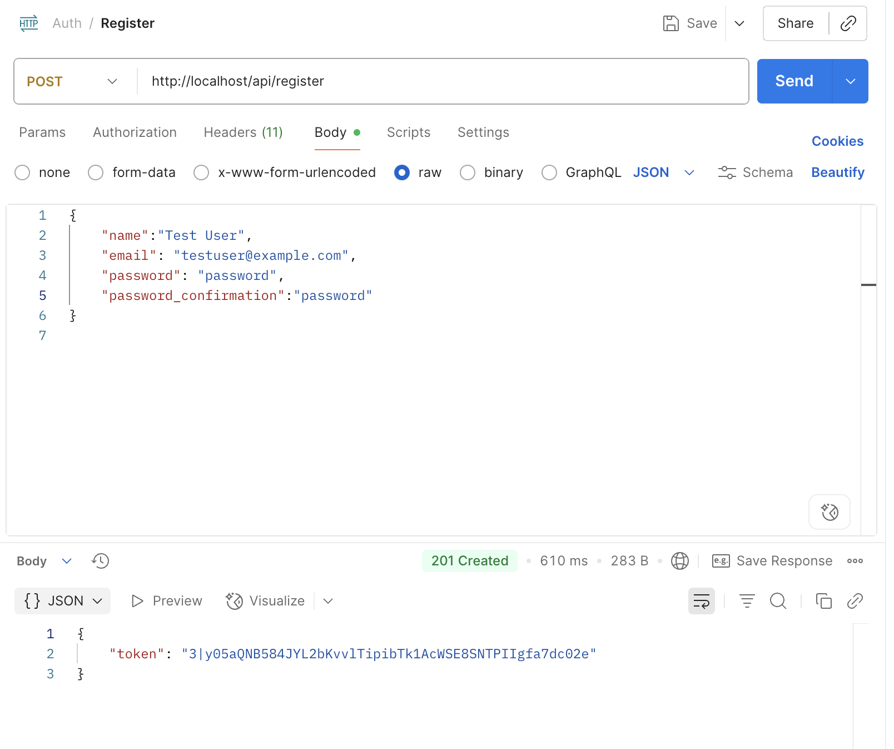
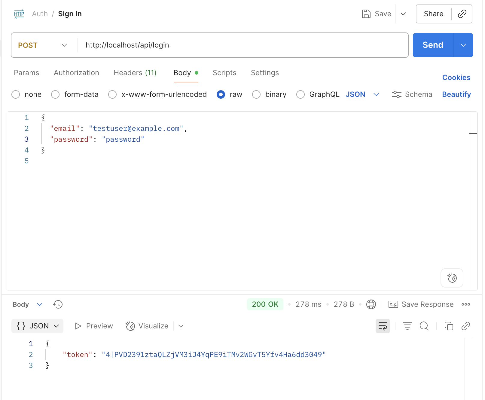

### CRUD Example
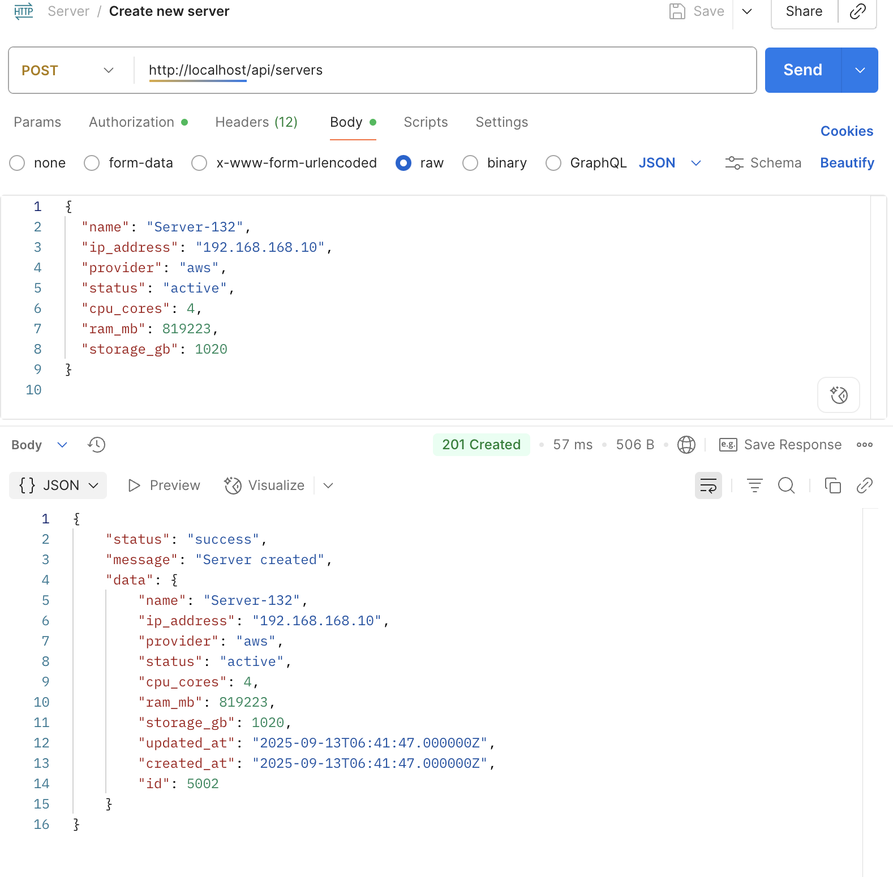
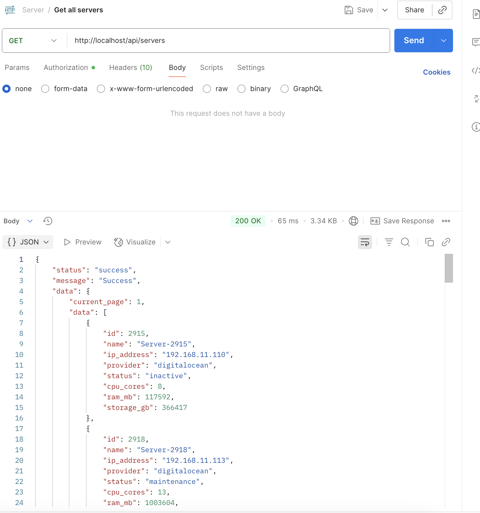
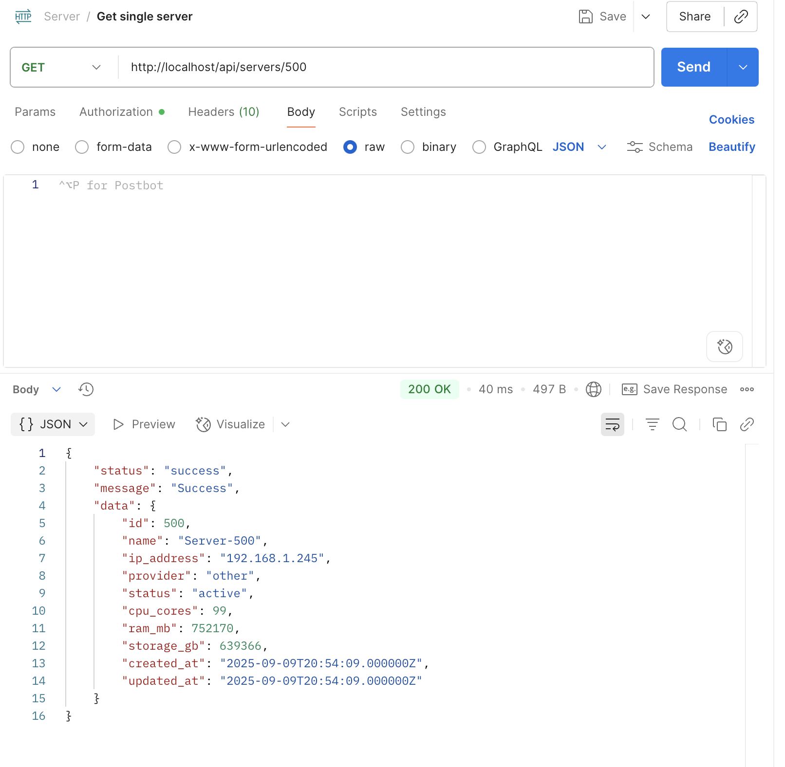
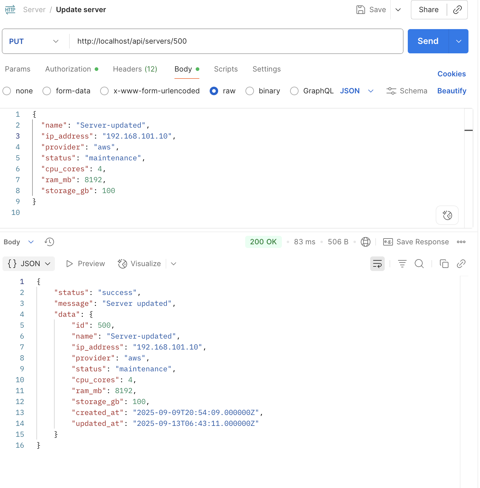
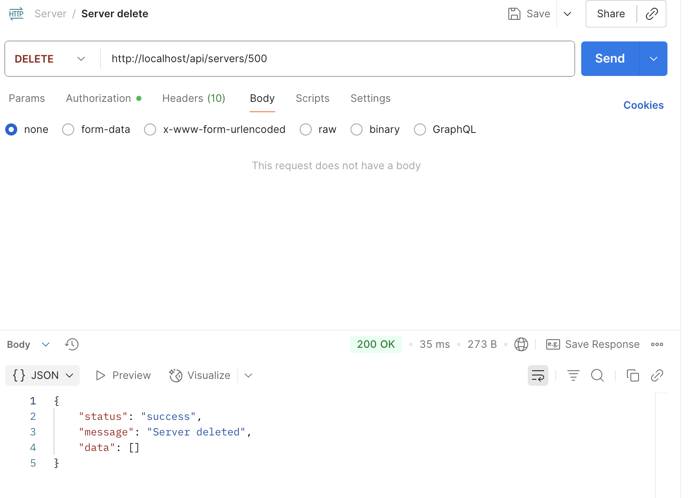

### Error Handling
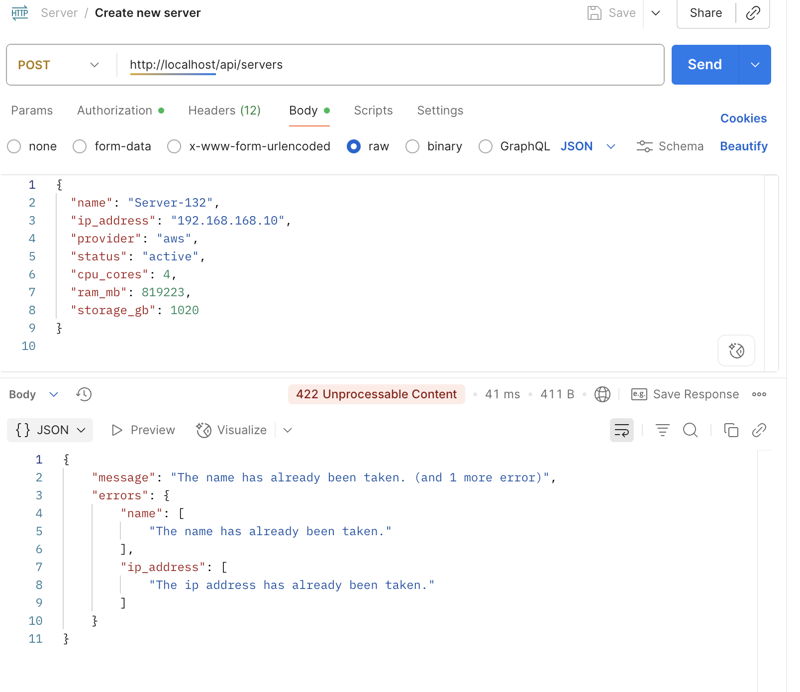

### Bulk Action
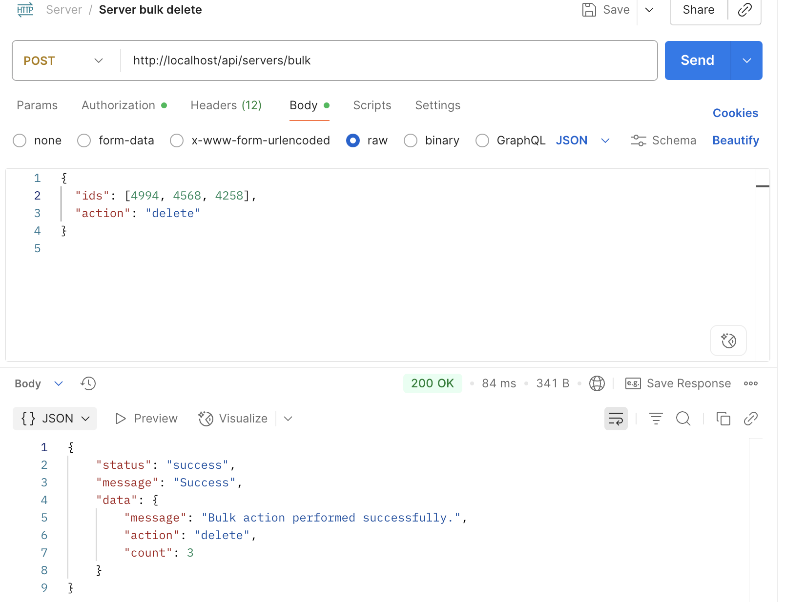

### Slow
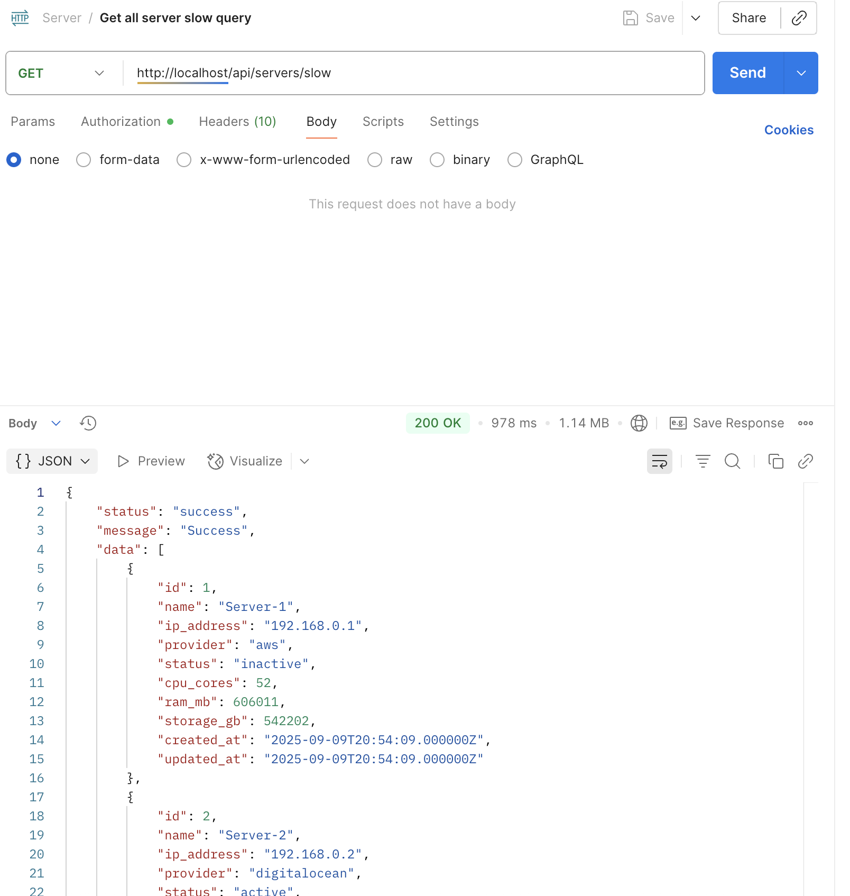

### Optimized
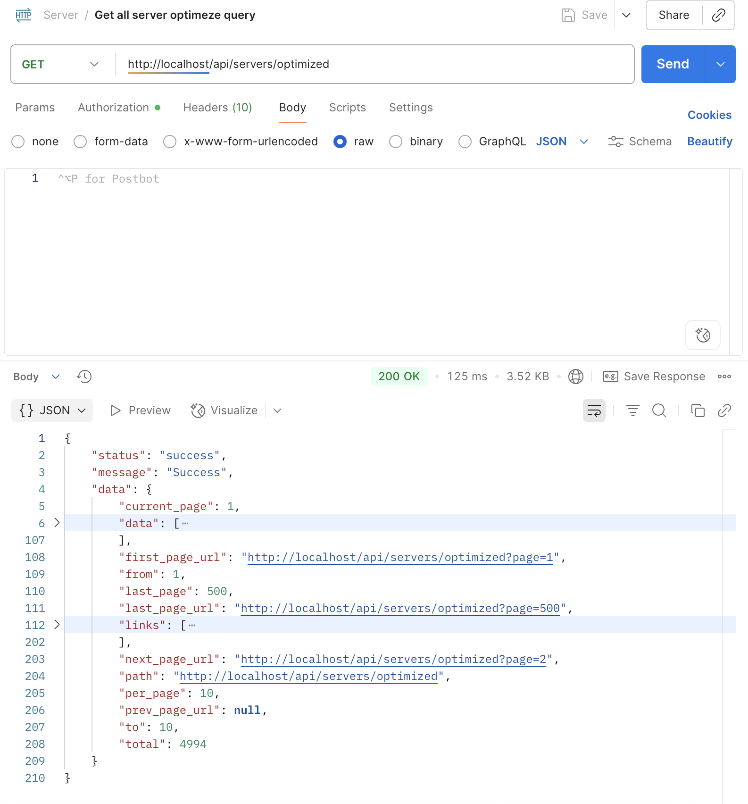

